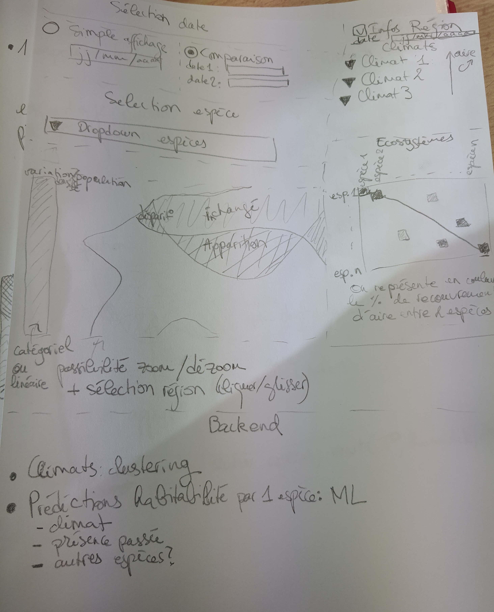

# visu-biodiversite

## Présentation

On cherche à observer la répartition des espèces au cours du temps et à es recouper avec les prédictions climatiques pour savoir quelles régions seraient menacées. La partie de prédiction se fait avec du machine learning (ML inachevé).

A droite se trouve un matrice d'adjacence de différentes espèces (pour l'instant remplie avec des valeurs aléatoires par défaut).

## Prototype papier



## Installation

Décompresser l'archive "data" dans le dossier du projet en conservant le même nom.

Dans le terminal, se placer dans le répertoire du projet et lancer un simple serveur html.

```
python3 -m http.server
```

## Crédits

Données des coraux utilisés pour la démonstrations : https://www.kaggle.com/datasets/noaa/deep-sea-corals?resource=download

Données pour le tracé de la carte : https://github.com/martynafford/natural-earth-geojson